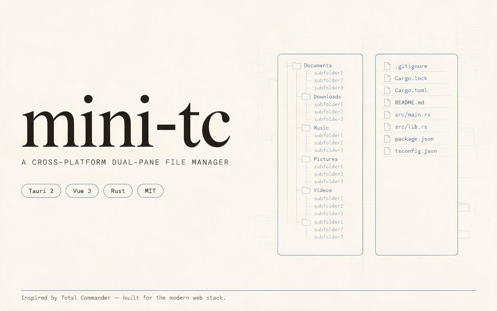

# mini-tc

<p align="center">
  
</p>

<p align="center"><em>基于 Tauri 2 + Vue 3 的跨平台双栏文件管理器，致敬 Total Commander。</em></p>

---

## 功能

- 左右双栏布局，可拖拽调整面板宽度
- 每栏独立多 Tab 管理，Tab 状态自动持久化
- 可编辑路径栏 + 盘符下拉切换
- 文件列表按名称 / 大小 / 修改时间排序
- **启动屏（splash）**：冷启动时全屏 logo + 三点循环加载，至少 1.2s 满屏 + 0.6s 柔和淡出（`SPLASH_MIN_SHOW_MS` / `SPLASH_FADE_MS` 常量在 `src/main.js` 顶部，按需调）
- **文件预览**（Ctrl+Q）：文本（txt/md/json/log）和图片（jpg/png/gif/webp/bmp/svg/avif）；图片经 asset protocol 直接加载，无大小限制；文本预览区内可拖选文字按 Ctrl+C 复制，或点 footer「复制全部」复制整篇
- **视频预览**：`mp4/webm/ogv/mov/m4v` 等由 WebView 直接解码（含字幕自动探测同目录 `srt/vtt/ass`、外挂字幕、±0.5s 偏移微调、倍速、音量记忆）；`mkv/avi/flv/wmv/rmvb` 等无法解码的格式自动回退「用系统播放器打开」，HEVC/H.265 这类「有声音没画面」的情况也会自动识别并回退。控制栏中**进度条常驻**（随时可见当前位置、可拖动 seek），仅下方按钮行在播放 3 秒后自动收起，鼠标移回底部或暂停时立即恢复
- 4 套内置主题（石墨工业 / 霓虹暗夜 / 暖茶拿铁 / 墨竹青翠）
- Ctrl+Tab 快速切换左右面板
- **右键上下文菜单**：在空白处右键可「新建目录」（在当前目录创建空文件夹，创建后可直接改名）；在文件/文件夹上右键可「打开」「复制路径」；对压缩包（zip/rar/7z/tar/gz/iso…）自动探测本机已安装的 **7-Zip / WinRAR / unzip**，提供「解压到当前文件夹」「解压到同名文件夹」入口，解压后自动刷新面板
- **复制 / 剪切 / 粘贴**（Ctrl+C / Ctrl+X / Ctrl+V）：与系统剪贴板双向互通（Windows `CF_HDROP`，可与资源管理器互拷），支持多选批量与跨卷移动，拷贝过程带进度条；目标存在同名项时可选「跳过 / 覆盖」。
  - 覆盖策略（防数据丢失 + 目录合并）：同名**文件夹**冲突时采用**合并**（merge）而非整目录替换删除——例如把 `root/a/a` 移动/拷贝到 `root/`，其内容会并入已存在的 `root/a`（移动后 `root/a/a` 自身被清空移除），不会误删数据；同名**文件**冲突才按覆盖/跳过处理。仍拒绝真正危险的操作：把目录移动到自身内部（`root/a` → `root/a/b`）。跨卷移动若复制阶段出错则保留源文件不删除。
- **鼠标拖拽移动**（跨应用、跨进程）：直接用鼠标把文件/文件夹（单个或 Ctrl/Shift 多选集合）拖到目标文件夹、空白区（= 当前目录）或「..」（= 父目录）即可移动到该目录；支持**跨栏拖拽**（从左栏拖到右栏目录），**也支持直接拖到资源管理器 / QQ / 7-Zip 等外部应用**——接收方拿到的是真实文件（Windows 走 `CF_HDROP` + `Preferred DropEffect=DROPEFFECT_MOVE`，macOS 走 `NSFilenamesPboardType`），行为与从资源管理器拖出完全一致；外部往 mini-tc 拖入的文件则按复制（copy）处理，落到文件行上忽略。落点高亮提示，移动/复制后自动刷新源栏与目标栏，冲突处理与同名项合并策略复用粘贴逻辑。
  - ⚠️ **依赖 `tauri-plugin-drag`（CrabNebula 维护的 drag-rs）**：前端在文件行 `dragstart` 时调用 `startDrag({ item: 绝对路径, mode: 'move' })`，Rust 后端走 Windows 的 OLE `DoDragDrop` / macOS 的 `NSPasteboard` 直接写出 `CF_HDROP` / `NSFilenamesPboardType`。预览图标故意传一个无法解码的字节（0x00），让 drag-rs 跳过 `IDragSourceHelper::InitializeFromBitmap`，由 OS 从 `CF_HDROP` 自动渲染文件图标（多文件显示「多文件缩略图 + 数量」），行为与资源管理器完全一致；如果传了真实图标则会覆盖 OS 默认渲染，反而不如默认直观。Linux 下 drag-rs 需 GTK 应用窗口（winit 类不支持），跨进程拖出会失效，本项目不针对 Linux 保证。`dragDropEnabled: true` 让 Tauri 接管 webview 拖放，配合 `tauri://drag-enter / drag-over / drag-drop / drag-leave` 事件拿到光标坐标 + 文件路径；前端 `elementFromPoint(x, y)` 反推落点（目录行 / `..` / 空白区 / 文件行），自拖自时走 move（cut），外部拖入时走 copy。
- **删除 / 永久删除**：`Delete`（`Ctrl/Cmd+Backspace` 同效）移入系统回收站；**`Shift+Delete` 永久删除**——绕过回收站、无法恢复，按下去直接抹除，不弹确认框。两者在权限不足（只读、被占用、系统文件）时都自动回退到 **UAC 提权删除**
  - 删除后光标自动落到**最后删除项的下一个文件**（若删的是末尾一段，则回退到它前面最近的一个幸存项），单选与多选行为一致，不会清空选中
- **窗口切回自动恢复选中与键盘焦点**：从外部程序（例如 7-Zip 解压窗口）切回 mini-tc 时，自动重新列目录、恢复切换前的选中项并滚动到可见位置、把键盘焦点交还给文件列表，方向键可直接继续操作；正在输入（地址栏 / 文件名过滤 / 内联改名）或焦点在预览区内时不抢焦点
- **快捷键自定义**（配置 → 快捷键设置）：独立页面集中展示代码中的全部快捷键；支持按名称/组合键搜索、按作用域（全局 / 文件列表 / 视频播放）分组折叠、录制式重新绑定（Ctrl / Alt / Shift / Command 任意组合）、同一命令绑定多个快捷键、同作用域重复时红色高亮冲突并提示占用方。配置持久化到 `~/.minitc/shortcuts.json`，仅存增量，新版本新增的默认快捷键会自动生效
- **自动更新**（帮助 → 检查更新）
- Windows / macOS / Linux 跨平台支持

## 技术栈

| 层 | 技术 |
|---|------|
| 桌面框架 | [Tauri 2](https://v2.tauri.app/) |
| 前端 | Vue 3 + Vite 5 |
| 后端 | Rust (20+ 条 Tauri 命令) |
| 编译 | MSVC (Windows) / Clang (macOS) / GCC (Linux) |

## 前置条件

- [Rust](https://rustup.rs/) (stable-msvc on Windows)
- [Node.js](https://nodejs.org/) >= 18
- Windows：Visual Studio 2022 Build Tools（含 C++ 桌面开发工作负载）
- macOS：Xcode Command Line Tools
- Linux：`build-essential` + `libwebkit2gtk-4.1-dev` 等

## 快速开始

```bash
# 克隆仓库
git clone https://cnb.cool/simon-lei/mini-tc.git
cd mini-tc

# 安装前端依赖
npm install

# 启动开发模式
npx tauri dev
```

## 构建生产版本

```bash
# 生成签名密钥（仅首次）
npx tauri signer generate -p mini-tc-updater -w src-tauri/keys/mini-tc.key

# 构建并准备发布产物
bash scripts/release/build-release.sh
```

产物在 `scripts/release/out/` 下，包含 `.msi` 安装包和 `latest.json` 更新清单。

## 发布新版本

构建与发布由 GitHub Actions 自动完成（见 [`.github/workflows/release.yml`](.github/workflows/release.yml)）：

1. 修改 `package.json` 和 `src-tauri/tauri.conf.json` 中的版本号
2. 提交后打 tag 并推送：`git tag v0.x.0 && git push github v0.x.0`
3. Actions 自动构建 Windows / macOS / Linux 三平台安装包并发布到 [GitHub Releases](https://github.com/simonlei/mini-tc/releases)，同时生成带签名的 `latest.json` 更新清单
4. 已安装用户下次启动时点击 **帮助 → 检查更新** 即可自动升级

## Windows 安装提示（SmartScreen）

`x64-setup.exe` 未做 Authenticode 代码签名（个人开源项目未购买证书），首次运行会被 Microsoft Defender SmartScreen 拦截，提示「已保护你的电脑 / 发布者未知」。

继续安装：点击弹窗中 **「更多信息」→「仍要运行」** 即可。

文件来自 [GitHub Actions 构建](https://github.com/simonlei/mini-tc/actions)，构建过程公开可审计，可放心运行。


## 项目结构

```
mini-tc/
├── src/                      # Vue 前端
│   ├── App.vue               # 主双面板布局 + 菜单栏
│   ├── main.js               # 应用入口
│   ├── api.js                # Tauri invoke 封装
│   ├── style.css             # 全局样式（4 套主题变量）
│   ├── shortcuts.js          # 快捷键注册表：命令 / 作用域 / 匹配 / 冲突检测
│   └── components/
│       ├── FilePanel.vue        # 面板容器（Tab + 路径 + 文件列表 + 右键菜单）
│       ├── TabBar.vue           # 多 Tab 管理
│       ├── PathBar.vue          # 可编辑路径栏 + 盘符切换 + 面包屑
│       ├── FileList.vue         # 文件列表（排序 + 多选 + 右键触发）
│       ├── FilePreview.vue      # 文件预览（文本/图片）
│       ├── VideoPreview.vue     # 视频预览
│       ├── ContextMenu.vue      # 通用右键菜单组件
│       ├── SettingsDialog.vue   # 文件预览设置
│       └── ShortcutsDialog.vue  # 快捷键设置（独立页面）
├── src-tauri/                # Rust 后端
│   ├── src/
│   │   ├── main.rs
│   │   └── lib.rs            # list_directory / read_file_preview / extract_archive / get_archive_tools 等
│   ├── tauri.conf.json
│   └── icons/
├── .cnb.yml                  # CNB CI 流水线配置
├── package.json
└── vite.config.mjs
```

## License

MIT
