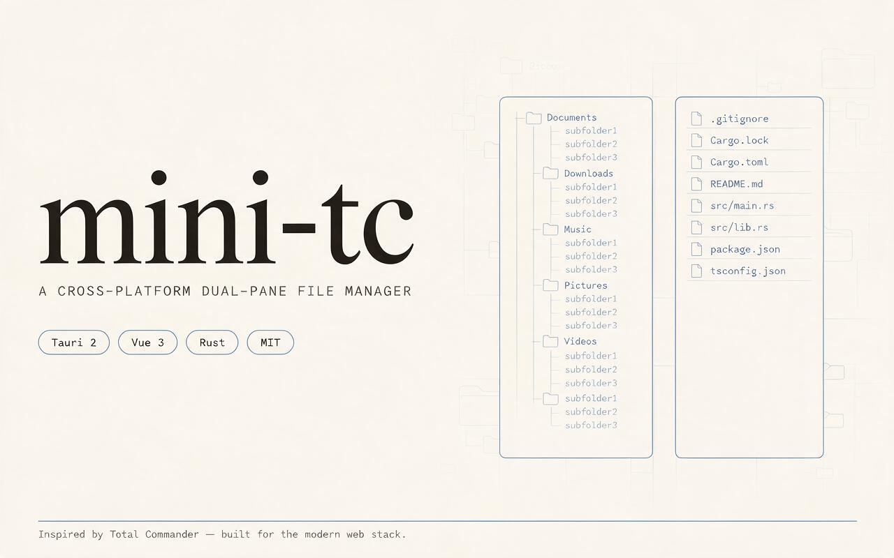

# mini-tc

<p align="center">
  
</p>

<p align="center"><em>基于 Tauri 2 + Vue 3 的跨平台双栏文件管理器，致敬 Total Commander。</em></p>

---

## 功能

- 左右双栏布局，可拖拽调整面板宽度（比例会被记住，下次启动保持，双击分隔条复位）
- 每栏独立多 Tab 管理，Tab 状态自动持久化
- 可编辑路径栏 + 盘符下拉切换
- 文件列表按名称 / 大小 / 修改时间排序（名称排序时：忽略连字符 `-`，如 `-1a.txt` 按 `1a.txt` 比较；中文字符排在数字与英文字母之后，如 `0.txt` < `a.txt` < `推特.txt`；数字段按数值自然排序，`1a.jpg` < `2c.jpg` < `10b.jpg`）
- **启动屏（splash）**：冷启动时全屏 logo + 三点循环加载。展示**至少 250ms**，并等左右两栏首次列目录都完成才淡出（250ms），另有 2500ms 硬兜底防止慢目录/网络盘把用户堵在加载页；常量 `SPLASH_MIN_SHOW_MS` / `SPLASH_FADE_MS` / `SPLASH_MAX_SHOW_MS` 在 `src/main.js` 顶部，其中淡出时长由 JS 在运行时内联写入 `transitionDuration`，是单一真源（`index.html` 里的 CSS 只是兜底，别再两处各写一份）
- **启动耗时埋点**：`src/bootLog.js` + 后端 `boot_mark` / `boot_timings` 命令，开发模式下 devtools 控制台会打印两张 `console.table`（JS 阶段 / Rust 阶段，共用同一时钟可直接对齐），Rust 侧另有 `[boot] ... ms` 逐行输出到控制台窗口。用 `localStorage.setItem("minitc-boot-log", "off")` 可关闭
- **文件预览**（Ctrl+Q）：文本（txt/md/json/log）、图片（jpg/png/gif/webp/bmp/svg/avif）、HEIC 系列（heic/heif/hif/avci）和 PDF/doc/docx；图片经 asset protocol 直接加载，无大小限制；文本预览区内可拖选文字按 Ctrl+C 复制，或点 footer「复制全部」复制整篇
  - **HEIC/HEIF 预览**：WebView2 无原生 HEIC 解码器，走 `src/heicDecoder.js` + `src/heicDecode.worker.js` —— Worker 里用 **libheif 的 WebAssembly 版**解码成 RGBA，主线程再 canvas 编成 JPEG 交给 ``，图上标注「已转换为 JPEG」。wasm 约 2 MB，按需加载（`?worker` 导入 + `optimizeDeps.include` 登记），启动不受影响。设了两道防爆上限：单文件 60 MB、解码后 5000 万像素（12MP 手机照片约需 48.8 MB RGBA 缓冲）
  - **为什么不用 heic2any**（已移除）：它内嵌的是 emscripten **asm.js** 版 libheif，YUV→RGBA 转换跑在 JS 解释器上。实测 12MP 手机照片中位数：**asm.js 1047 ms vs wasm 422 ms（2.5x）**。⚠️ `libheif-js` 的 package.json `main` 指向的正是 asm.js 版（`libheif/libheif.js`），必须显式引 `libheif-wasm/libheif-bundle.mjs` 才拿到 wasm
  - **HEIC 耗时诊断**：每次预览在 devtools 控制台打一张折叠表（`[heic] <文件名> <总耗时> ms`），分 `start / file-read / worker-decode / encoded / ready / painted` 六步，**每文件一张**可左右对比。`worker-decode` 的 note 里进一步拆出 `hevc=Xms`（比特流解码）和 `rgba=Yms`（颜色转换）。失败、翻页中断、超限中止三种情况也会补打（末行标 `failed` / `interrupted` / `aborted`）
  - **⚠️ 剩余慢点**：换成 wasm 后 12MP 仍需约 420 ms，**瓶颈依然是全尺寸 YUV420→RGBA 转换**（HEVC 比特流解码只占 2–10 ms）。根治要靠降采样，但 libheif-js 的高层 API 不暴露尺寸参数（C API 有 `heif_image_scale_image` 但缺 `set_maximum_image_size` 便捷封装，需手工调 emscripten 指针）。后端 Rust `libheif-rs` 有干净的 `HeifDecodingOptions::max_width`，是后续方向
- **视频预览**：`mp4/webm/ogv/mov/m4v` 等由 WebView 直接解码（含字幕自动探测同目录 `srt/vtt/ass`、外挂字幕、±0.5s 偏移微调、倍速、音量记忆）；`mkv/avi/flv/wmv/rmvb` 等无法解码的格式自动回退「用系统播放器打开」，HEVC/H.265 这类「有声音没画面」的情况也会自动识别并回退。控制栏中**进度条常驻**（随时可见当前位置、可拖动 seek），仅下方按钮行在播放 3 秒后自动收起，鼠标移回底部或暂停时立即恢复
  - **预览时窗口置顶**（配置 → 通用设置，**默认关闭**）：开启后播放视频预览时 MiniTC 窗口保持在所有窗口之上，关闭预览（Esc / 切换到别的文件 / 关掉面板）后自动还原层级。⚠️ 置顶是**操作系统窗口级**属性，所以浮起来的是**整个 MiniTC 窗口**（含文件列表），不是只有视频画面那一块——浏览器没有任何 API 能把单个 DOM 元素抬到其他程序窗口之上，想做到「只有视频浮在最上层」必须把播放器拆成独立的置顶窗口。置顶联动由一个 `watch` 驱动 `src/alwaysOnTop.js`（对 ↑/↓ 切片、面板切换、自动连播、Esc 全部自动生效，且做了状态去重与失败回滚），退出时强制还原以免留下置顶窗口。
- **通用设置**（配置 → 通用设置）：应用级配置项的独立页面，与「文件预览设置」（只管单个文件怎么渲染）和「快捷键设置」并列。配置项以声明式 schema（`GeneralSettingsDialog.vue` 顶部的 `ITEMS` 数组）声明，新增一项只需加一个对象，UI 渲染 / 持久化 / 缺省回退自动获得。持久化到 `~/.minitc/app-config.json`
- 4 套内置主题（石墨工业 / 霓虹暗夜 / 暖茶拿铁 / 墨竹青翠）
- **Tab 切换左右面板**（与 Total Commander 一致）：焦点在文件列表时按光标 `Tab` 即在左/右栏之间跳转，切换后键盘焦点交给新面板，方向键直接接着操作。焦点不在文件列表上（地址栏 / 文件名过滤 / 内联改名 / 对话框 / 右键菜单）时 `Tab` 保持浏览器的原生焦点切换行为不被抢走
- **多标签页快捷键**（与 Total Commander 一致）：`Ctrl+T` 在**当前活动面板**按当前目录新开一个标签页，`Ctrl+W` 关闭该面板的当前标签页（仅剩一个时无操作，不会把最后一栏关掉），`Ctrl+Tab` / `Ctrl+Shift+Tab` 在该面板的标签页之间**轮换**（到底后回到第一个，环绕不卡住）。四者都在地址栏 / 文件名过滤框获得焦点时同样生效，且执行后键盘焦点自动交回文件列表，方向键可直接操作新标签页。轮换成功时会弹一条 toast 报出落点路径；只有一个标签页时静默忽略。左右栏各轮各的，互不影响
- **标签页锁定 / 一键回到锁定位置**（对应 TC 的「锁定，但允许更改文件夹」）：`Ctrl+Shift+L` 把当前标签页的所在目录记为**锁定锚点**（已锁定时再按一次解除），`Ctrl+Y` 把该标签页跳回锚点。⚠️ 锁定**不阻止目录切换**——标签页仍可自由进出任何目录，锁定的只是「回家的路」，这点与 TC 一致（TC 另有 `Ctrl+Num*` 的严格锁定，即禁止换目录，本应用未实现）。标签栏上已锁定的标签显示 🔒 并染上淡色底，悬停提示里同时给出当前路径与锁定路径；**在标签页上右键**弹出菜单：锁定当前位置 / 回到锁定位置 / 以当前目录重新锁定 / 关闭此标签页。锁定锚点随标签页一起持久化到 `~/.minitc/tabs-<panelId>.json`，重启后依然有效（旧存档无该字段即视为未锁定）
- **右键上下文菜单**：在空白处右键可「新建目录」（在当前目录创建空文件夹，创建后可直接改名）；在文件/文件夹上右键可「打开」「复制路径」；对压缩包（zip/rar/7z/tar/gz/iso…）自动探测本机已安装的 **7-Zip / WinRAR / unzip**，提供「解压到当前文件夹」「解压到同名文件夹」入口，解压后自动刷新面板；**多选多个压缩包时按顺序逐个解压**（菜单标签显示「依次解压 N 个」，图形界面工具会等上一个窗口结束再启动下一个，不会一次弹出 N 个窗口），失败的压缩包在汇总提示里列出文件名，成功的部分照常生效
- **复制 / 剪切 / 粘贴**（Ctrl+C / Ctrl+X / Ctrl+V）：与系统剪贴板双向互通（Windows `CF_HDROP`，可与资源管理器互拷），支持多选批量与跨卷移动，拷贝过程带进度条；目标存在同名项时可选「跳过 / 覆盖」。
  - 覆盖策略（防数据丢失 + 目录合并）：同名**文件夹**冲突时采用**合并**（merge）而非整目录替换删除——例如把 `root/a/a` 移动/拷贝到 `root/`，其内容会并入已存在的 `root/a`（移动后 `root/a/a` 自身被清空移除），不会误删数据；同名**文件**冲突才按覆盖/跳过处理。仍拒绝真正危险的操作：把目录移动到自身内部（`root/a` → `root/a/b`）。跨卷移动若复制阶段出错则保留源文件不删除。
- **F5 复制到对面栏 / Shift+F5 移动到对面栏**（与 Total Commander 一致）：把**当前活动面板**的选中项直接送到**对面面板当前所在的目录**。与 `Ctrl+V` 是两条独立的路——`Ctrl+V` 只认系统剪贴板，F5/Shift+F5 完全不碰剪贴板（连复制都不写剪贴板），源目录与目标目录可以在任意两个盘符之间。执行后两个面板都自动刷新，键盘焦点留在**源面板**，可以继续按方向键操作原选中项。
  - 目标已有同名项时复用粘贴的冲突确认（跳过 / 覆盖），目录冲突同样是**合并**而非替换删除
  - 与拖拽一致地跳过无意义项：已经直接躺在目标目录里的文件不会被「移动到自身所在目录」
  - 两栏停在同一目录时直接提示「对面栏与当前栏在同一目录」，不做自我复制
  - 与其他 `F*` 快捷键（`F2` 重命名）一样可在**配置 → 快捷键设置**里改键；焦点在内联改名输入框内时 F5 不生效（那是文本框）
- **鼠标拖拽移动**（跨应用、跨进程）：直接用鼠标把文件/文件夹（单个或 Ctrl/Shift 多选集合）拖到目标文件夹、空白区（= 当前目录）或「..」（= 父目录）即可移动到该目录；支持**跨栏拖拽**（从左栏拖到右栏目录），**也支持直接拖到资源管理器 / QQ / 7-Zip 等外部应用**——接收方拿到的是真实文件（Windows 走 `CF_HDROP` + `Preferred DropEffect=DROPEFFECT_MOVE`，macOS 走 `NSFilenamesPboardType`），行为与从资源管理器拖出完全一致；外部往 mini-tc 拖入的文件则按复制（copy）处理，落到文件行上忽略。落点高亮提示，移动/复制后自动刷新源栏与目标栏，冲突处理与同名项合并策略复用粘贴逻辑。
  - ⚠️ **依赖 `tauri-plugin-drag`（CrabNebula 维护的 drag-rs）**：前端在文件行 `dragstart` 时调用 `startDrag({ item: 绝对路径, mode: 'move' })`，Rust 后端走 Windows 的 OLE `DoDragDrop` / macOS 的 `NSPasteboard` 直接写出 `CF_HDROP` / `NSFilenamesPboardType`。预览图标故意传一个无法解码的字节（0x00），让 drag-rs 跳过 `IDragSourceHelper::InitializeFromBitmap`，由 OS 从 `CF_HDROP` 自动渲染文件图标（多文件显示「多文件缩略图 + 数量」），行为与资源管理器完全一致；如果传了真实图标则会覆盖 OS 默认渲染，反而不如默认直观。Linux 下 drag-rs 需 GTK 应用窗口（winit 类不支持），跨进程拖出会失效，本项目不针对 Linux 保证。`dragDropEnabled: true` 让 Tauri 接管 webview 拖放，配合 `tauri://drag-enter / drag-over / drag-drop / drag-leave` 事件拿到光标坐标 + 文件路径；前端 `elementFromPoint(x, y)` 反推落点（目录行 / `..` / 空白区 / 文件行），自拖自时走 move（cut），外部拖入时走 copy。
- **删除 / 永久删除**：`Delete`（`Ctrl/Cmd+Backspace` 同效）移入系统回收站；**`Shift+Delete` 永久删除**——绕过回收站、无法恢复，按下去直接抹除，不弹确认框。两者在权限不足（只读、被占用、系统文件）时都自动回退到 **UAC 提权删除**
  - 删除后光标自动落到**最后删除项的下一个文件**（若删的是末尾一段，则回退到它前面最近的一个幸存项），单选与多选行为一致，不会清空选中
- **窗口切回自动恢复选中与键盘焦点**：从外部程序（例如 7-Zip 解压窗口）切回 mini-tc 时，自动重新列目录、恢复切换前的选中项并滚动到可见位置、把键盘焦点交还给文件列表，方向键可直接继续操作；正在输入（地址栏 / 文件名过滤 / 内联改名）或焦点在预览区内时不抢焦点
- **窗口位置 / 大小 / 全屏状态记忆**：关闭时记下窗口的位置、大小以及是否最大化 / 全屏，下次启动直接恢复到上次的模样，无需手动摆。
  - 存档在 `~/.minitc/window-state.json`（dev 模式另存 `window-state-dev.json`，避免调试时的窗口尺寸污染正式版），由后端 `src-tauri/src/window_state.rs` 在 `setup` 阶段读写，**前端零参与**——所以不占用启动预算，也没有「先闪一下默认尺寸再跳过去」的跳动（`tauri.conf.json` 里窗口设 `visible: false`，几何套用完才 `show()`）。
  - 几个已处理的边界：**最大化 / 全屏 / 最小化时读到的几何不可信**（全屏时等于整块屏幕，最小化时 Windows 给的是 `-32000` 的 iconic 偏移），这些状态下只更新标志位、几何保持最后一次普通态的值，于是「还原」不会得到一个全屏大小的窗口；**外接显示器拔掉后**存档位置会落在屏幕外，此时自动回退到居中（判定要求整条标题栏仍在工作区内，否则用户抓不到窗口拖不回来）；跨屏导致的 DPI 变化（`ScaleFactorChanged`）也会一并采样。
  - 拖动 / 缩放时 `Moved` / `Resized` 是每秒几十次的高频事件，直接每次写盘会拖垮主线程 IO，所以只保留最后一次几何、由后台线程每 400ms 落盘一次，窗口关闭时再强制同步一次（写临时文件 + 改名，避免崩溃时留下半截 JSON）。
- **左右分栏比例记忆**：拖动中间分隔条调整左右面板宽度后，下次启动保持上次的比例。**双击分隔条**可一键复位为 50/50。
  - 存档在 `~/.minitc/panel-split.json`，存的是**比例**（左栏 flex-grow 系数）而非像素宽度：两侧 wrapper 都是 `flex-basis: 0` 的 flex 子元素，比例本身就完整决定分割，所以窗口缩放或换到另一块显示器后比例依然成立，不会因为上次记的是 640px 而在新屏上显得突兀。
  - 落盘做了 300ms 防抖（拖动时 mousemove 每几毫秒一次）；**拖动路径本身也参与调度**，这样即使鼠标在窗口外松开、`mouseup` 收不到，最后一次移动的结果依然会写盘。
  - 恢复时重新 clamp 到 20%~80%，并且非有限值（配置被改坏）直接忽略退回 50/50，不会出现某一栏被压成 0 的情况。配置读取是异步的，若用户在这期间就拖了分隔条，以用户操作为准、不覆盖。
- **快捷键自定义**（配置 → 快捷键设置）：独立页面集中展示代码中的全部快捷键；支持按名称/组合键搜索、按作用域（全局 / 文件列表 / 视频播放）分组折叠、录制式重新绑定（Ctrl / Alt / Shift / Command 任意组合）、同一命令绑定多个快捷键、同作用域重复时红色高亮冲突并提示占用方。配置持久化到 `~/.minitc/shortcuts.json`，仅存增量，新版本新增的默认快捷键会自动生效
- **自动更新**（帮助 → 检查更新）
- Windows / macOS / Linux 跨平台支持

## 技术栈

| 层 | 技术 |
|---|------|
| 桌面框架 | [Tauri 2](https://v2.tauri.app/) |
| 前端 | Vue 3 + Vite 5 |
| 后端 | Rust (20+ 条 Tauri 命令) |
| 编译 | MSVC (Windows) / Clang (macOS) / GCC (Linux) |

## 前置条件

- [Rust](https://rustup.rs/) (stable-msvc on Windows)
- [Node.js](https://nodejs.org/) >= 18
- Windows：Visual Studio 2022 Build Tools（含 C++ 桌面开发工作负载）
- macOS：Xcode Command Line Tools
- Linux：`build-essential` + `libwebkit2gtk-4.1-dev` 等

## 快速开始

```bash
# 克隆仓库
git clone https://cnb.cool/simon-lei/mini-tc.git
cd mini-tc

# 安装前端依赖
npm install

# 启动开发模式
npx tauri dev
```

也可以用启动脚本，它会自动探测 Node.js 与 MSVC 环境：

```bash
./dev.sh            # 或 Windows 下双击 dev.bat —— 开发模式
./dev.sh build      # 构建发布版
./dev.sh check      # 仅 cargo check
./dev.sh clean      # 清理构建产物
./dev.sh deps       # 强制 npm install
```

> `npm install` 只在 `package.json` / `package-lock.json` 变化后才会真正执行
> （依赖已同步时 npm 仍要约 20 秒却什么都不装）。改依赖后若想手动强制安装，
> 跑 `./dev.sh deps` / `dev.bat deps`。

`dev.sh` / `dev.bat` 的每个阶段都会打印耗时，便于定位慢在哪：

```
   [探测 Node.js] 569 ms
   [探测 MSVC] 1126 ms
   [MSVC 环境] 323 ms
   [cargo check] 13846 ms
   [总计] 17162 ms
```

## 构建生产版本

```bash
# 生成签名密钥（仅首次）
npx tauri signer generate -p mini-tc-updater -w src-tauri/keys/mini-tc.key

# 构建并准备发布产物
bash scripts/release/build-release.sh
```

产物在 `scripts/release/out/` 下，包含 `.msi` 安装包和 `latest.json` 更新清单。

## 发布新版本

构建与发布由 GitHub Actions 自动完成（见 [`.github/workflows/release.yml`](.github/workflows/release.yml)）：

1. 修改 `package.json` 和 `src-tauri/tauri.conf.json` 中的版本号
2. 提交后打 tag 并推送：`git tag v0.x.0 && git push github v0.x.0`
3. Actions 自动构建 Windows / macOS / Linux 三平台安装包并发布到 [GitHub Releases](https://github.com/simonlei/mini-tc/releases)，同时生成带签名的 `latest.json` 更新清单
4. 已安装用户下次启动时点击 **帮助 → 检查更新** 即可自动升级

## Windows 安装提示（SmartScreen）

`x64-setup.exe` 未做 Authenticode 代码签名（个人开源项目未购买证书），首次运行会被 Microsoft Defender SmartScreen 拦截，提示「已保护你的电脑 / 发布者未知」。

继续安装：点击弹窗中 **「更多信息」→「仍要运行」** 即可。

文件来自 [GitHub Actions 构建](https://github.com/simonlei/mini-tc/actions)，构建过程公开可审计，可放心运行。


## 项目结构

```
mini-tc/
├── src/                      # Vue 前端
│   ├── App.vue               # 主双面板布局 + 菜单栏
│   ├── main.js               # 应用入口
│   ├── api.js                # Tauri invoke 封装
│   ├── style.css             # 全局样式（4 套主题变量）
│   ├── shortcuts.js          # 快捷键注册表：命令 / 作用域 / 匹配 / 冲突检测
│   ├── alwaysOnTop.js         # 窗口置顶控制器（去重 / 失败回滚 / 退出还原）
│   ├── heicDecoder.js         # HEIC 解码主线程侧：Worker 调度 +像素转 JPEG
│   ├── heicDecode.worker.js   # HEIC 解码 Worker：libheif wasm → RGBA
│   └── components/
│       ├── FilePanel.vue        # 面板容器（Tab + 路径 + 文件列表 + 右键菜单）
│       ├── TabBar.vue           # 多 Tab 管理
│       ├── PathBar.vue          # 可编辑路径栏 + 盘符切换 + 面包屑
│       ├── FileList.vue         # 文件列表（排序 + 多选 + 右键触发）
│       ├── FilePreview.vue      # 文件预览（文本/图片）
│       ├── VideoPreview.vue     # 视频预览
│       ├── ContextMenu.vue      # 通用右键菜单组件
│       ├── SettingsDialog.vue   # 文件预览设置
│       ├── GeneralSettingsDialog.vue # 通用设置（声明式 ITEMS schema）
│       └── ShortcutsDialog.vue  # 快捷键设置（独立页面）
├── src-tauri/                # Rust 后端
│   ├── src/
│   │   ├── main.rs
│   │   ├── lib.rs            # list_directory / read_file_preview / extract_archive / get_archive_tools 等
│   │   └── window_state.rs   # 窗口位置/大小/最大化/全屏持久化（setup 阶段恢复 + 防抖落盘）
│   ├── tauri.conf.json
│   └── icons/
├── .cnb.yml                  # CNB CI 流水线配置
├── package.json
└── vite.config.mjs
```

## License

MIT
